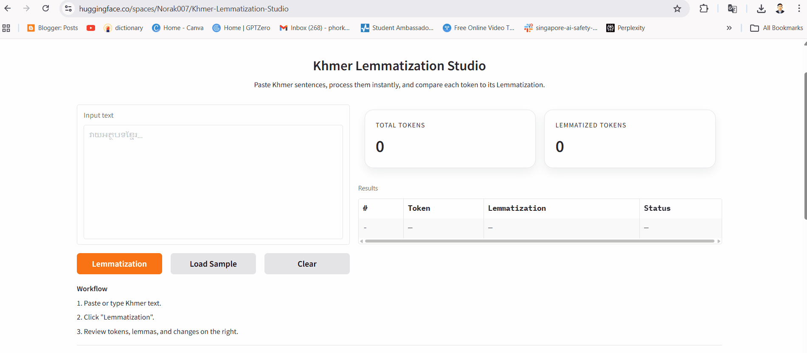

# Khmer Lemmatization Studio

A web-based tool designed to help Khmer students easily identify **ពាក្យឫស** (root words) from **ពាក្យកម្លាយ** (lemmatize words) in Khmer text.

## What is Lemmatization?

In Khmer, many words are lemmatize from a simpler root form. for example, **កកាយ** comes from the root **កាយ**, and **គំនិត** comes from **គិត**. Understanding this relationship is essential for:

- Reading comprehension and vocabulary building
- Natural language processing (NLP) research

This tool automates that process: paste any Khmer text, and it instantly shows you each word alongside its root form.

## Demo



## Features

- **Word tokenization**  splits Khmer text into individual words using a CRF-based model ([khmer-nltk](https://github.com/VietHoang1512/khmer-nltk))
- **Root word lookup**  maps ពាក្យកម្លាយ to their ពាក្យឫស using a curated dictionary
- **Token-level results table**  shows every word, its root form, and whether it changed
- **Combined output**  joins all root forms into a single copyable text, useful for pasting into ChatGPT to reduce Khmer token usage
- **Summary statistics**  total word count and number of words that were lemmatized
- **Sample text**  one-click load of example Khmer sentences to get started
- **Full dictionary view**  browse all entries directly in the UI

## How to Use

1. Paste or type Khmer text into the input box
2. Click **រកពាក្យឫស** (Find Root Words)
3. Review the results table  each row shows the original word and its root form

## Project Structure

```
khmer_lemmatization/
├── app.py                       # Main Gradio application
├── khmer_lemma_dictionary.json  # Dictionary mapping ពាក្យកម្លាយ → ពាក្យឫស
├── requirements.txt             # Python dependencies
└── README.md
```

## Getting Started

### Prerequisites

- Python 3.9 or higher

### Installation

```bash
git clone https://github.com/PhorkNorak/Khmer-Lemmatization.git
cd Khmer-Lemmatization

python -m venv venv
source venv/bin/activate  # Windows: venv\Scripts\activate

pip install -r requirements.txt
```

### Run Locally

```bash
python app.py
```

Then open your browser at `http://127.0.0.1:7860`.

## Dictionary

The lemma dictionary (`khmer_lemma_dictionary.json`) contains **60 entries** compiled from:

> **Teacher Vatha** — [១០០០ពាក្យកម្លាយដោយផ្នត់ដើម (YouTube)](https://youtu.be/mfWl3fV7oMo?si=OuR45gnDqeml2oXw)

Contributions to expand the dictionary are welcome  see [Contributing](#contributing).

## Deployment

This app is deployed on [Hugging Face Spaces](https://huggingface.co/spaces/Norak007/Khmer-Lemmatization-Studio).

## Contributing

To add more words to the dictionary:

1. Fork the repository
2. Edit `khmer_lemma_dictionary.json`  add entries as `"ពាក្យកម្លាយ": "ពាក្យឫស"`
3. Open a pull request with a brief description

## Team

| Name | Role | Link |
|------|------|------|
| Dr. Khim Chomrouen | Advisor | [cadt.edu.kh](https://cadt.edu.kh/team/chamroeun-khim-phd/) |
| Dr. Mao Makara | Advisor | [researchgate.net](https://www.researchgate.net/profile/Makara-Mao) |
| Phork Norak | Developer | [phorknorak.vercel.app](https://phorknorak.vercel.app/) |
| Nhor Povketya | Data Collection | [povketya.github.io/ketyanhor](https://povketya.github.io/ketyanhor/) |
| Ly Hor | Data Collection | [final-portfolio-kappa-rust.vercel.app](https://final-portfolio-kappa-rust.vercel.app/) |

---
